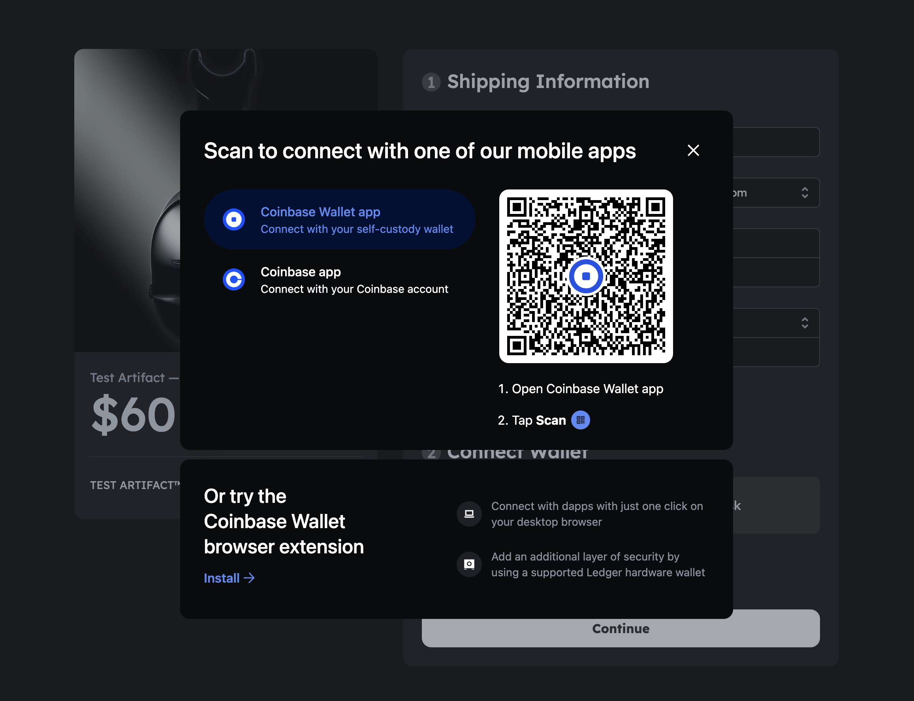
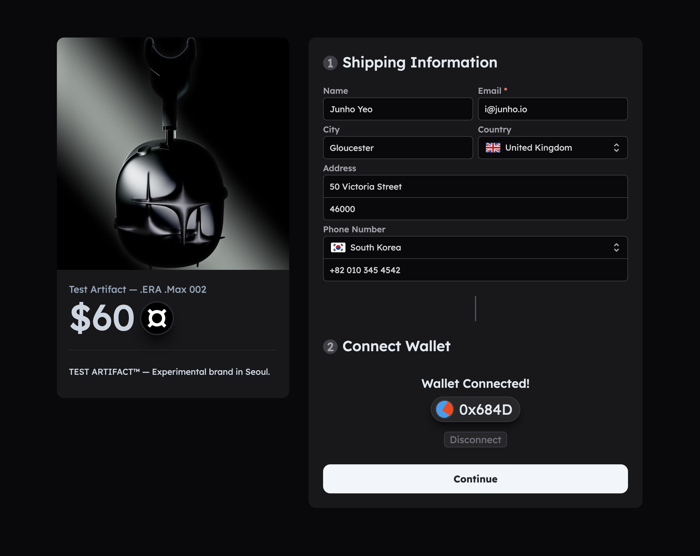
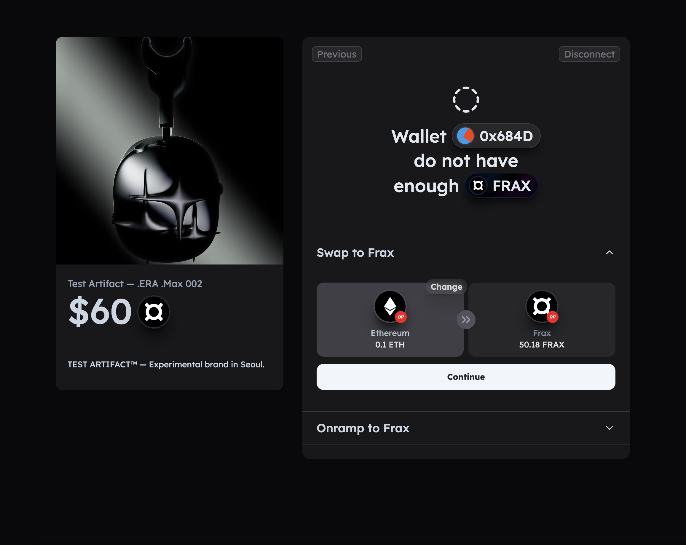

# ¤ FraxPay by Inevitable

**FraxPay** was built during the **Hackathon [FraxBuild 2023](https://dorahacks.io/hackathon/fraxbuild/track) under the Consumer Adoption Track**, enabling merchants and content creators to accept payments in Frax Stablecoins seamlessly. We have integrated Fraxswap into our smart contract-based payment gateway, thereby providing the option for users to pay with any token.

1. Payment Gateway integrated with Fraxswap
2. Dashboard
3. Payment Links with Easy-to-use Customer Onboarding
4. Frontend Widgets/SDK for FraxPay and Fraxswap







## 🔴 Deployments

### FraxPay

- Optimism(`FraxPayCore`): `0x986ec2aeE73E21B28b29A2E040DDFfd839F6F07d`

### Ecosystem

- Optimism(`Frax Token`): `0x2E3D870790dC77A83DD1d18184Acc7439A53f475`
- Optimism(`FraxSwapRouterV2`): `0xB9A55F455e46e8D717eEA5E47D2c449416A0437F`

## 🛠️ Contributing

### Setup Environment Variables

```conf
# contracts/.env
PRIVATE_KEY=
```

```conf
# interface/.env
JWT_SECRET=
NEXT_AUTH_SECRET=
UPSTASH_URL=
UPSTASH_TOKEN=
NEXT_PUBLIC_SIGNIN_MESSAGE="Sign In to FraxPay"
NEXT_PUBLIC_OPTIMISM_RPC_URL=
```

### Run!

```bash
# install dependencies
yarn
```

```bash
# start frontend dev server
yarn workspace interface dev
```
